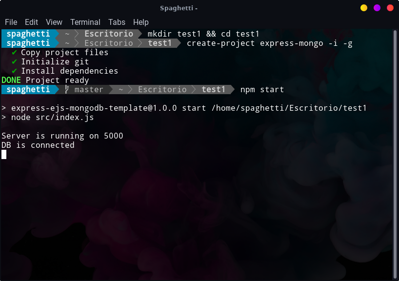
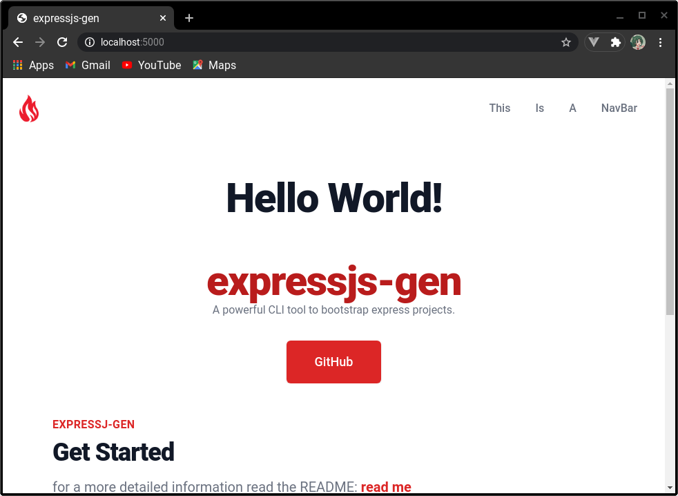

# expressjs-generator-javascript
## A powerful CLI tool to bootstrap express.js - mongodb projects!

## Global Installation:
```bash
npm i -g expressjs-generator-javascript
```
## Create your template  by typing:
```bash
create-project 
```

## There's a few options that you can add in to skip choises:
```bash
create-project express-mongo 
```
To skip manual install:
```bash
--install or -i
```
To skip manual git init:
```bash
--git or -g
```
### Example using all flags:
```bash
mkdir test1

cd test1

create-project express-mongo -i -g

npm start
```
Example:

Browser at localhost:5000/

## To run your project template:

```nodejs
npm start
(Note that the server is running in port 5000, but you can change it at: src/index.js to avoid any conflits)
```

## Clone this repository and make it fit to your project's measure:
```bash
git clone https://github.com/alejandro0619/express-generator-javascript.git
```

## Have problems? [Open a issue!](https://github.com/alejandro0619/express-generator-javascript/issue)

## Get in touch: [Gmail](spaghetticodedev@gmail.com)